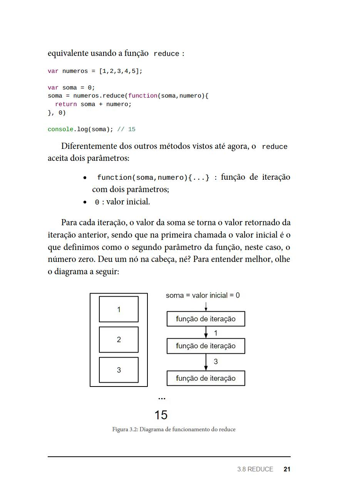

# REDUCE

<p>
    A função auxiliar reduce foi deixada para o final por ser a
    mais complicada. </brr>
    A ideia por trás dela é pegar todos os valores de
    um Array e condensá-los em um único. Para demonstrar seu
    funcionamento, vamos mostrar um caso clássico de uso.
    Neste exemplo, vamos fazer a soma de todos os elementos de
    dentro de um Array.</br>
    Como fizemos nos outros, primeiro
    implementamos uma abordagem mais comum:
<op>

```
$ node reduce1.js
```

<p>
    Aqui não tem segredo. Apenas iteramos a lista com um laço de
    repetição e usamos a variável soma , inicializada em 0 , para
    acumular o resultado. </br>
    Agora perceba como temos o efeito
</p>

```
$ node reduce2.js
```

<p>
    Diferentmente dos outros métodos vistos até agora, o reduce aceita dois parâmetros
</p>

